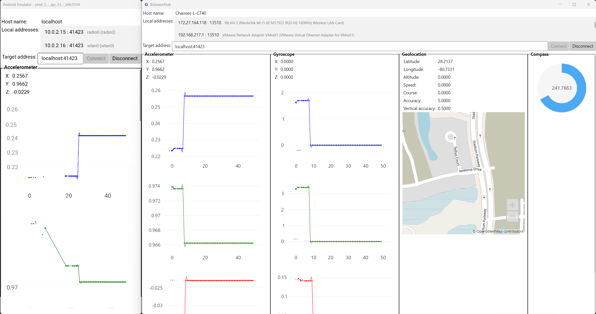
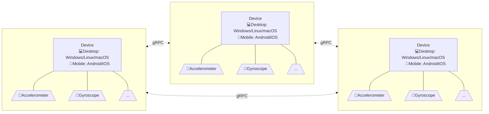

# IbSensorHub


Access device sensors remotely.

## Installation
Windows:
1. Download the archive from [Releases](https://github.com/Chaoses-Ib/IbSensorHub/releases).
2. Extract and run.

   .NET 7 with Desktop Runtime is required. If you havn't installed it before, you can install it via winget:
   ```cmd
   winget install Microsoft.DotNet.DesktopRuntime.7
   ```
   or [download the installer manually](https://dotnet.microsoft.com/en-us/download/dotnet/7.0).

Android:
1. Download the APK from [Releases](https://github.com/Chaoses-Ib/IbSensorHub/releases).
2. Install.

Linux, macOS and iOS are theoretically supported, but not actually tested due to the lack of appropriate devices.

## Architecture

IbSensorHub uses a peer-to-peer network architecture, which means that any device can be both a client and a server. For example, you can access the sensor of a phone from a laptop, or *vice varse*. You can also access the sensor of a device of the same type, i.e. phone-to-phone, laptop-to-laptop.

gRPC interface: [sensor.proto](protos/sensor.proto)

Server implementations:
- .NET

Client implementations:
- .NET

## Supported sensors
| Sensor | Android | iOS | UWP | ~~watchOS~~ | ~~tvOS~~ | ~~Tizen~~ | macOS |
| --- | :---: | :---: | :---: | :---: | :---: | :---: | :---: |
| Accelerometer | ✔️ | ✔️ | ✔️ | ✔️ | ❌ | ✔️ | ❌ |
| Barometer | ✔️ | ✔️ | ✔️ | ✔️ | ❌ | ✔️ | ❌ |
| Compass | ✔️ | ✔️ | ✔️ | ❌ | ❌ | ✔️ | ❌ |
| Geolocation | ✔️ | ✔️ | ✔️ | ❌ | ❌ | ✔️ | ✔️ |
| Gyroscope | ✔️ | ✔️ | ✔️ | ✔️ | ❌ | ✔️ | ❌ |
| Magnetometer | ✔️ | ✔️ | ✔️ | ✔️ | ❌ | ✔️ | ❌ |
| Orientation | ✔️ | ✔️ | ✔️ | ✔️ | ❌ | ✔️ | ❌ |
| Shake | ✔️ | ✔️ | ✔️ | ✔️ | ❌ | ✔️ | ❌ |
<!--
https://learn.microsoft.com/en-us/xamarin/essentials/platform-feature-support

^\|(.*?)\|(.*?)\|(.*?)\|(.*?)\|(.*?)\|(.*?)\|(.*?)\|(.*?)\|

| App Actions | ✔️ | ✔️ | ✔️ | ❌ | ❌ | ❌ | ❌ |
| App Information | ✔️ | ✔️ | ✔️ | ❌ | ✔️ | ✔️ | ✔️ |
| App Theme | ✔️ | ✔️ | ✔️ | ✔️ | ❌ | ✔️ | ✔️ |

| Battery | ✔️ | ✔️ | ✔️ | limited | ❌ | limited | ✔️ |
| Clipboard | ✔️ | ✔️ | ✔️ | ❌ | ❌ | ❌ | ✔️ |
| Color Converters | ✔️ | ✔️ | ✔️ | ✔️ | ✔️ | ✔️ | ✔️ |

| Connectivity | ✔️ | ✔️ | ✔️ | ❌ | ✔️ | ✔️ | ✔️ |
| Contacts | ✔️ | ✔️ | ✔️ | ❌ | ❌ | ✔️ | ❌ |
| Detect Shake | ✔️ | ✔️ | ✔️ | ✔️ | ✔️ | ✔️ | ❌ |
| Device Display Information | ✔️ | ✔️ | ✔️ | ❌ | ❌ | ❌ | ✔️ |
| Device Information | ✔️ | ✔️ | ✔️ | ✔️ | ✔️ | ✔️ | ✔️ |
| Email | ✔️ | ✔️ | ✔️ | ❌ | ❌ | ✔️ | ✔️ |
| File Picker | ✔️ | ✔️ | ✔️ | ❌ | ❌ | ✔️ | ✔️ |
| File System Helpers | ✔️ | ✔️ | ✔️ | ✔️ | ✔️ | ✔️ | ✔️ |
| Flashlight | ✔️ | ✔️ | ✔️ | ❌ | ❌ | ✔️ | ❌ |
| Geocoding | ✔️ | ✔️ | ✔️ | ✔️ | ✔️ | ✔️ | ✔️ |

| Haptic Feedback | ✔️ | ✔️ | ✔️ | ❌ | ❌ | ✔️ | ✔️ |
| Launcher | ✔️ | ✔️ | ✔️ | ❌ | ❌ | ✔️ | ✔️ |

| MainThread | ✔️ | ✔️ | ✔️ | ✔️ | ✔️ | ✔️ | ✔️ |
| Maps | ✔️ | ✔️ | ✔️ | ✔️ | ❌ | ✔️ | ✔️ |
| Media Picker | ✔️ | ✔️ | ✔️ | ❌ | ❌ | ✔️ | limited |
| Open Browser | ✔️ | ✔️ | ✔️ | ❌ | ❌ | ✔️ | ✔️ |

| Permissions | ✔️ | ✔️ | ✔️ | ✔️ | ✔️ | ✔️ | ✔️ |
| Phone Dialer | ✔️ | ✔️ | ✔️ | ❌ | ❌ | ✔️ | ✔️ |
| Platform Extensions | ✔️ | ✔️ | ✔️ | ✔️ | ✔️ | ✔️ | ✔️ |
| Preferences | ✔️ | ✔️ | ✔️ | ✔️ | ✔️ | ✔️ | ✔️ |
| Screenshot | ✔️ | ✔️ | ✔️ | ❌ | ❌ | ❌ | ❌ |
| Secure Storage | ✔️ | ✔️ | ✔️ | ✔️ | ✔️ | ✔️ | ✔️ |
| Share | ✔️ | ✔️ | ✔️ | ❌ | ❌ | ✔️ | ✔️ |
| SMS | ✔️ | ✔️ | ✔️ | ❌ | ❌ | ✔️ | ✔️ |
| Text-to-Speech | ✔️ | ✔️ | ✔️ | ✔️ | ✔️ | ✔️ | ✔️ |
| Unit Converters | ✔️ | ✔️ | ✔️ | ✔️ | ✔️ | ✔️ | ✔️ |
| Version Tracking | ✔️ | ✔️ | ✔️ | ✔️ | ✔️ | ✔️ | ✔️ |
| Vibrate | ✔️ | ✔️ | ✔️ | ❌ | ❌ | ✔️ | ❌ |
| Web Authenticator | ✔️ | ✔️ | ✔️ | ❌ | ✔️ | ❌ | ✔️ |
-->

## To-dos
- [ ] Rust and AutoHotkey clients
- [ ] Python clients
- [ ] WinRT sensors